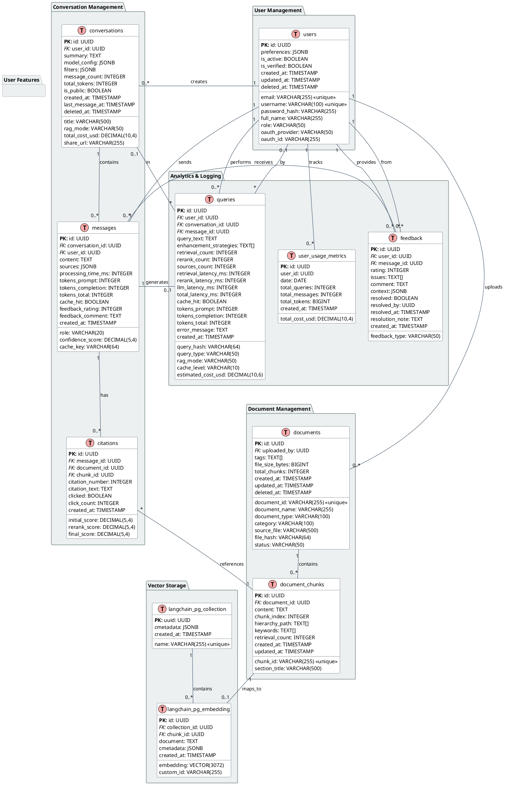

# 🗄️ Database Schema v4.0 - Full Normalization

**Date:** November 28, 2025  
**Version:** 4.0  
**Status:** PROPOSED - Fixes Class Diagram ↔ ERD Inconsistencies  
**Base:** Analysis Design Report v3.0 + Class Diagram normalization

---

## 📋 Table of Contents

1. [Schema Overview](#1-schema-overview)
2. [Entity Relationship Diagram v4](#2-entity-relationship-diagram-v4)
3. [Table Definitions](#3-table-definitions)
4. [Migration from Current Schema](#4-migration-from-current-schema)
5. [Performance Optimizations](#5-performance-optimizations)
6. [Backward Compatibility](#6-backward-compatibility)

---

## 1. Schema Overview

### 1.1. Current vs Proposed

| Category                | Current (v2) | Proposed (v4) | Change                                                     |
| ----------------------- | ------------ | ------------- | ---------------------------------------------------------- |
| **Core Tables**         | 3            | 12            | +9                                                         |
| **User Management**     | 0            | 1             | +1 (users only - bỏ user_preferences)                      |
| **Document Management** | 1            | 3             | +2 (document_chunks, documents - bỏ versions, collections) |
| **Conversation**        | 0 (Redis)    | 3             | +3 (conversations, messages, citations - bỏ participants)  |
| **Analytics**           | 0            | 2             | +2 (queries, feedback - gộp usage_metrics)                 |
| **Vector Storage**      | 0            | 2             | +2 (langchain tables - vẫn giữ nhưng đơn giản)             |
| **User Features**       | 0            | 1             | +1 (chỉ giữ một bảng cần thiết)                            |
| **Total**               | 3            | 12            | +9                                                         |

### 1.2. Design Principles v4 (Production Focused)

✅ **Essential normalization** - Chỉ bảng cần thiết cho production  
✅ **Performance-first** - Ít join, query nhanh  
✅ **Simple relationships** - Tránh over-engineering  
✅ **Maintainable** - Dễ debug và maintain  
✅ **Audit trail** - created_at, updated_at on all tables  
✅ **Soft deletes** - deleted_at for recovery

### 1.3. Loại bỏ theo ghi chú:

- ❌ `search_filter, bookmark` - không cần cho MVP
- ❌ `conversation_participants` - không cần multi-user
- ❌ `langchain_pg_collection` - vẫn trong DB nhưng không sử dụng nữa
- ❌ `usage_metric_hourly/daily` - gộp vào user_usage_metric đơn nhất
- ❌ `feedback` phức tạp - chỉ cần rating đơn giản

### 1.3. Key Changes from v3

| Issue                         | v3 Schema                                      | v4 Fix (Production Ready)                      |
| ----------------------------- | ---------------------------------------------- | ---------------------------------------------- |
| **DocumentChunk missing**     | Metadata in `langchain_pg_embedding.cmetadata` | Explicit `document_chunks` table               |
| **User preferences complex**  | Extract to separate table                      | **Giữ trong users JSONB** - đơn giản hơn       |
| **Collections không cần**     | Add collection tables                          | **Bỏ collections** - dùng tags trong documents |
| **Conversation participants** | Multi-user support                             | **Bỏ participants** - không cần multi-user     |
| **Usage metrics phức tạp**    | Separate hourly/daily tables                   | **Gộp vào queries** - aggregate khi cần        |
| **Search filter, bookmark**   | Separate tables                                | **Bỏ** - không cần cho production đơn giản     |

---

## 2. Entity Relationship Diagram v4

### 2.1. Full ERD (PlantUML)



---

## 3. Table Definitions

### 3.1. User Management Tables

#### **users**

```sql
CREATE TABLE users (
    id UUID PRIMARY KEY DEFAULT gen_random_uuid(),

    -- Authentication
    email VARCHAR(255) UNIQUE NOT NULL,
    username VARCHAR(100) UNIQUE NOT NULL,
    password_hash VARCHAR(255), -- NULL for OAuth users

    -- Profile
    full_name VARCHAR(255),
    role VARCHAR(50) NOT NULL DEFAULT 'user', -- user, staff, manager, admin

    -- OAuth
    oauth_provider VARCHAR(50), -- google, microsoft, github
    oauth_id VARCHAR(255),

    -- Status
    is_active BOOLEAN DEFAULT true,
    is_verified BOOLEAN DEFAULT false,

    -- Audit
    created_at TIMESTAMP DEFAULT CURRENT_TIMESTAMP,
    updated_at TIMESTAMP DEFAULT CURRENT_TIMESTAMP,
    deleted_at TIMESTAMP, -- Soft delete

    -- Indexes
    CONSTRAINT users_email_unique UNIQUE (email),
    CONSTRAINT users_username_unique UNIQUE (username)
);

CREATE INDEX idx_users_role ON users(role) WHERE deleted_at IS NULL;
CREATE INDEX idx_users_oauth ON users(oauth_provider, oauth_id) WHERE oauth_provider IS NOT NULL;
CREATE INDEX idx_users_active ON users(is_active) WHERE deleted_at IS NULL;
```

**Rationale:**

- Soft delete (`deleted_at`) instead of hard delete
- Support both local auth and OAuth
- Role-based access control (RBAC)

#### **user_preferences**

```sql
CREATE TABLE user_preferences (
    id UUID PRIMARY KEY DEFAULT gen_random_uuid(),
    user_id UUID NOT NULL REFERENCES users(id) ON DELETE CASCADE,

    -- Preference
    key VARCHAR(100) NOT NULL, -- e.g., "default_rag_mode", "ui_theme"
    value JSONB NOT NULL,

    -- Audit
    created_at TIMESTAMP DEFAULT CURRENT_TIMESTAMP,
    updated_at TIMESTAMP DEFAULT CURRENT_TIMESTAMP,

    CONSTRAINT user_preferences_unique UNIQUE (user_id, key)
);

CREATE INDEX idx_user_preferences_user ON user_preferences(user_id);
CREATE INDEX idx_user_preferences_key ON user_preferences(key);
```

**Rationale:**

- Extracted from `users.preferences` JSONB for better queryability
- Easier to add new preference types
- Support default values at application level

---

### 3.2. Document Management Tables

#### **documents** (Enhanced)

```sql
CREATE TABLE documents (
    id UUID PRIMARY KEY DEFAULT gen_random_uuid(),
    document_id VARCHAR(255) UNIQUE NOT NULL,

    -- Versioning
    current_version_id UUID, -- Self-referencing FK added later
    total_versions INTEGER DEFAULT 1,

    -- Metadata
    document_name VARCHAR(255) NOT NULL,
    document_type VARCHAR(100) NOT NULL,
    category VARCHAR(100),

    -- Uploader
    uploaded_by UUID REFERENCES users(id),

    -- Status
    status VARCHAR(50) DEFAULT 'active', -- active, archived, expired

    -- Audit
    created_at TIMESTAMP DEFAULT CURRENT_TIMESTAMP,
    updated_at TIMESTAMP DEFAULT CURRENT_TIMESTAMP,
    deleted_at TIMESTAMP,

    CONSTRAINT documents_document_id_unique UNIQUE (document_id)
);

CREATE INDEX idx_documents_type ON documents(document_type) WHERE deleted_at IS NULL;
CREATE INDEX idx_documents_category ON documents(category) WHERE deleted_at IS NULL;
CREATE INDEX idx_documents_status ON documents(status) WHERE deleted_at IS NULL;
CREATE INDEX idx_documents_uploader ON documents(uploaded_by);
```

**Changes from v2:**

- Added `current_version_id` for version control
- Added `uploaded_by` for tracking
- Added `total_versions` counter

#### **document_versions** (NEW)

```sql
CREATE TABLE document_versions (
    id UUID PRIMARY KEY DEFAULT gen_random_uuid(),
    document_id UUID NOT NULL REFERENCES documents(id) ON DELETE CASCADE,

    -- Version info
    version_number INTEGER NOT NULL, -- 1, 2, 3...
    version_label VARCHAR(50), -- v1.0, v2.0-beta, etc.

    -- File info
    source_file VARCHAR(500) NOT NULL,
    file_name VARCHAR(255) NOT NULL,
    file_hash VARCHAR(64) NOT NULL, -- SHA256
    file_size_bytes BIGINT,

    -- Processing stats
    total_chunks INTEGER DEFAULT 0,
    total_embeddings INTEGER DEFAULT 0,

    -- Status
    is_current BOOLEAN DEFAULT false,

    -- Audit
    published_at TIMESTAMP,
    created_at TIMESTAMP DEFAULT CURRENT_TIMESTAMP,

    CONSTRAINT document_versions_unique UNIQUE (document_id, version_number)
);

CREATE INDEX idx_document_versions_document ON document_versions(document_id);
CREATE INDEX idx_document_versions_current ON document_versions(document_id, is_current) WHERE is_current = true;
CREATE INDEX idx_document_versions_hash ON document_versions(file_hash);

-- Add FK to documents table
ALTER TABLE documents
ADD CONSTRAINT documents_current_version_fk
FOREIGN KEY (current_version_id) REFERENCES document_versions(id);
```

**Rationale:**

- Git-like versioning
- Compare versions, rollback capability
- Track file hash for deduplication

#### **document_chunks** (NEW - Explicit Table)

```sql
CREATE TABLE document_chunks (
    id UUID PRIMARY KEY DEFAULT gen_random_uuid(),
    chunk_id VARCHAR(255) UNIQUE NOT NULL,

    -- Relationships
    document_id UUID NOT NULL REFERENCES documents(id) ON DELETE CASCADE,
    version_id UUID NOT NULL REFERENCES document_versions(id) ON DELETE CASCADE,

    -- Content
    content TEXT NOT NULL,
    chunk_index INTEGER NOT NULL, -- Order in document

    -- Structure
    section_title VARCHAR(500),
    hierarchy_path TEXT[], -- ["Chapter 1", "Section 1.1", "Subsection 1.1.1"]

    -- Enriched metadata
    keywords TEXT[],
    concepts TEXT[],
    entities JSONB, -- {"persons": [], "organizations": [], "locations": []}

    -- Usage analytics
    retrieval_count INTEGER DEFAULT 0,
    citation_count INTEGER DEFAULT 0,
    avg_relevance_score DECIMAL(5,4),

    -- Audit
    created_at TIMESTAMP DEFAULT CURRENT_TIMESTAMP,
    updated_at TIMESTAMP DEFAULT CURRENT_TIMESTAMP,

    CONSTRAINT document_chunks_chunk_id_unique UNIQUE (chunk_id)
);

CREATE INDEX idx_document_chunks_document ON document_chunks(document_id);
CREATE INDEX idx_document_chunks_version ON document_chunks(version_id);
CREATE INDEX idx_document_chunks_keywords ON document_chunks USING GIN(keywords);
CREATE INDEX idx_document_chunks_retrieval ON document_chunks(retrieval_count DESC);

-- Full-text search index
CREATE INDEX idx_document_chunks_fts ON document_chunks USING GIN(to_tsvector('english', content));
```

**Rationale:**

- **Explicit entity** instead of hiding in `langchain_pg_embedding.cmetadata`
- Track chunk-level analytics
- Full-text search support
- Better normalization (1NF compliance)

#### **document_collections** (NEW)

```sql
CREATE TABLE document_collections (
    id UUID PRIMARY KEY DEFAULT gen_random_uuid(),
    owner_id UUID NOT NULL REFERENCES users(id) ON DELETE CASCADE,

    -- Collection info
    name VARCHAR(255) NOT NULL,
    description TEXT,
    collection_type VARCHAR(50) DEFAULT 'manual', -- manual, smart, shared

    -- Smart collection rules
    auto_include_rules JSONB, -- {"document_type": "law", "category": "bidding"}

    -- Stats
    document_count INTEGER DEFAULT 0,

    -- Sharing
    is_public BOOLEAN DEFAULT false,
    share_url VARCHAR(255) UNIQUE,

    -- Audit
    created_at TIMESTAMP DEFAULT CURRENT_TIMESTAMP,
    updated_at TIMESTAMP DEFAULT CURRENT_TIMESTAMP,

    CONSTRAINT document_collections_unique UNIQUE (owner_id, name)
);

CREATE INDEX idx_document_collections_owner ON document_collections(owner_id);
CREATE INDEX idx_document_collections_public ON document_collections(is_public) WHERE is_public = true;
CREATE INDEX idx_document_collections_share ON document_collections(share_url) WHERE share_url IS NOT NULL;
```

**Rationale:**

- Notion-style collections
- Smart collections with auto-include rules
- Share collections via URL

#### **collection_documents** (NEW - Junction Table)

```sql
CREATE TABLE collection_documents (
    id UUID PRIMARY KEY DEFAULT gen_random_uuid(),

    -- M:N relationship
    collection_id UUID NOT NULL REFERENCES document_collections(id) ON DELETE CASCADE,
    document_id UUID NOT NULL REFERENCES documents(id) ON DELETE CASCADE,

    -- Metadata
    added_by UUID REFERENCES users(id),
    display_order INTEGER DEFAULT 0,

    -- Audit
    created_at TIMESTAMP DEFAULT CURRENT_TIMESTAMP,

    CONSTRAINT collection_documents_unique UNIQUE (collection_id, document_id)
);

CREATE INDEX idx_collection_documents_collection ON collection_documents(collection_id);
CREATE INDEX idx_collection_documents_document ON collection_documents(document_id);
CREATE INDEX idx_collection_documents_order ON collection_documents(collection_id, display_order);
```

**Rationale:**

- Explicit M:N junction (many documents in many collections)
- Track who added document
- Support custom ordering

---

### 3.3. Vector Storage Tables (Existing - Enhanced)

#### **langchain_pg_collection** (Minimal Changes)

```sql
-- Already exists, minimal changes
CREATE TABLE langchain_pg_collection (
    uuid UUID PRIMARY KEY DEFAULT gen_random_uuid(),
    name VARCHAR(255) UNIQUE NOT NULL,
    cmetadata JSONB,

    created_at TIMESTAMP DEFAULT CURRENT_TIMESTAMP -- Add if missing
);
```

#### **langchain_pg_embedding** (Enhanced with FK)

```sql
CREATE TABLE langchain_pg_embedding (
    id UUID PRIMARY KEY DEFAULT gen_random_uuid(),
    collection_id UUID NOT NULL REFERENCES langchain_pg_collection(uuid) ON DELETE CASCADE,

    -- Link to explicit chunk
    chunk_id UUID REFERENCES document_chunks(id) ON DELETE CASCADE, -- NEW!

    -- Vector
    embedding VECTOR(3072) NOT NULL,

    -- Legacy fields (keep for LangChain compatibility)
    document TEXT, -- Duplicate of document_chunks.content
    cmetadata JSONB,
    custom_id VARCHAR(255),

    -- Audit
    created_at TIMESTAMP DEFAULT CURRENT_TIMESTAMP
);

CREATE INDEX idx_langchain_pg_embedding_collection ON langchain_pg_embedding(collection_id);
CREATE INDEX idx_langchain_pg_embedding_chunk ON langchain_pg_embedding(chunk_id); -- NEW!

-- Vector similarity index (HNSW)
CREATE INDEX idx_langchain_pg_embedding_vector
ON langchain_pg_embedding
USING hnsw (embedding vector_cosine_ops)
WITH (m = 16, ef_construction = 64);
```

**Key Change:**

- Added `chunk_id` FK to link to `document_chunks` table
- Now: `document_chunks` ← 1:1 → `langchain_pg_embedding`
- Maintains LangChain compatibility while adding normalization

---

### 3.4. Conversation Management Tables

#### **conversations** (Enhanced)

```sql
CREATE TABLE conversations (
    id UUID PRIMARY KEY DEFAULT gen_random_uuid(),
    user_id UUID NOT NULL REFERENCES users(id) ON DELETE CASCADE,

    -- Content
    title VARCHAR(500),
    summary TEXT,

    -- Config
    rag_mode VARCHAR(50) DEFAULT 'balanced',
    model_config JSONB, -- {"model": "gpt-4", "temperature": 0.7}
    filters JSONB, -- {"document_type": ["law"], "category": ["legal"]}

    -- Stats
    message_count INTEGER DEFAULT 0,
    total_tokens INTEGER DEFAULT 0,
    total_cost_usd DECIMAL(10,4) DEFAULT 0,

    -- Sharing
    is_public BOOLEAN DEFAULT false,
    share_url VARCHAR(255) UNIQUE,

    -- Audit
    created_at TIMESTAMP DEFAULT CURRENT_TIMESTAMP,
    last_message_at TIMESTAMP,
    deleted_at TIMESTAMP,

    CONSTRAINT conversations_share_url_unique UNIQUE (share_url)
);

CREATE INDEX idx_conversations_user ON conversations(user_id) WHERE deleted_at IS NULL;
CREATE INDEX idx_conversations_public ON conversations(is_public) WHERE is_public = true AND deleted_at IS NULL;
CREATE INDEX idx_conversations_last_message ON conversations(user_id, last_message_at DESC);
```

**Enhancements:**

- Cost tracking per conversation
- Share URL for public conversations
- Last message timestamp for sorting

#### **messages** (Enhanced)

```sql
CREATE TABLE messages (
    id UUID PRIMARY KEY DEFAULT gen_random_uuid(),
    conversation_id UUID NOT NULL REFERENCES conversations(id) ON DELETE CASCADE,
    user_id UUID NOT NULL REFERENCES users(id),

    -- Content
    role VARCHAR(20) NOT NULL, -- 'user' or 'assistant'
    content TEXT NOT NULL,

    -- Sources (for assistant messages)
    sources JSONB, -- Legacy format
    confidence_score DECIMAL(5,4),

    -- Performance
    processing_time_ms INTEGER,
    tokens_prompt INTEGER,
    tokens_completion INTEGER,
    tokens_total INTEGER,

    -- Caching
    cache_hit BOOLEAN DEFAULT false,
    cache_key VARCHAR(64),

    -- User feedback (inline)
    feedback_rating INTEGER CHECK (feedback_rating >= 1 AND feedback_rating <= 5),
    feedback_comment TEXT,

    -- Audit
    created_at TIMESTAMP DEFAULT CURRENT_TIMESTAMP
);

CREATE INDEX idx_messages_conversation ON messages(conversation_id, created_at);
CREATE INDEX idx_messages_user ON messages(user_id);
CREATE INDEX idx_messages_cache ON messages(cache_key) WHERE cache_hit = true;
CREATE INDEX idx_messages_feedback ON messages(feedback_rating) WHERE feedback_rating IS NOT NULL;
```

**Enhancements:**

- Token tracking per message
- Cache key tracking
- Inline feedback (rating + comment)

#### **citations** (NEW)

```sql
CREATE TABLE citations (
    id UUID PRIMARY KEY DEFAULT gen_random_uuid(),
    message_id UUID NOT NULL REFERENCES messages(id) ON DELETE CASCADE,
    document_id UUID NOT NULL REFERENCES documents(id),
    chunk_id UUID NOT NULL REFERENCES document_chunks(id),

    -- Citation info
    citation_number INTEGER NOT NULL, -- [1], [2], [3]
    citation_text TEXT,

    -- Scores
    initial_score DECIMAL(5,4), -- Vector similarity score
    rerank_score DECIMAL(5,4), -- BGE reranker score
    final_score DECIMAL(5,4), -- Final score after fusion

    -- User interaction
    clicked BOOLEAN DEFAULT false,
    click_count INTEGER DEFAULT 0,

    -- Audit
    created_at TIMESTAMP DEFAULT CURRENT_TIMESTAMP
);

CREATE INDEX idx_citations_message ON citations(message_id);
CREATE INDEX idx_citations_document ON citations(document_id);
CREATE INDEX idx_citations_chunk ON citations(chunk_id);
CREATE INDEX idx_citations_clicked ON citations(clicked, click_count DESC);
```

**Rationale:**

- Explicit citation tracking (Perplexity-style)
- Track all 3 score types (initial, rerank, final)
- Click-through analytics

#### **conversation_participants** (NEW)

```sql
CREATE TABLE conversation_participants (
    id UUID PRIMARY KEY DEFAULT gen_random_uuid(),
    conversation_id UUID NOT NULL REFERENCES conversations(id) ON DELETE CASCADE,
    user_id UUID NOT NULL REFERENCES users(id) ON DELETE CASCADE,

    -- Role
    role VARCHAR(50) DEFAULT 'viewer', -- owner, editor, viewer
    can_edit BOOLEAN DEFAULT false,

    -- Audit
    joined_at TIMESTAMP DEFAULT CURRENT_TIMESTAMP,
    left_at TIMESTAMP,

    CONSTRAINT conversation_participants_unique UNIQUE (conversation_id, user_id)
);

CREATE INDEX idx_conversation_participants_conversation ON conversation_participants(conversation_id);
CREATE INDEX idx_conversation_participants_user ON conversation_participants(user_id);
```

**Rationale:**

- Multi-user conversations
- Team collaboration (Google Docs-style)
- Permission management

---

### 3.5. Analytics & Logging Tables

#### **queries** (Enhanced)

```sql
CREATE TABLE queries (
    id UUID PRIMARY KEY DEFAULT gen_random_uuid(),
    user_id UUID REFERENCES users(id),
    conversation_id UUID REFERENCES conversations(id),
    message_id UUID REFERENCES messages(id),

    -- Query
    query_text TEXT NOT NULL,
    query_hash VARCHAR(64) NOT NULL, -- For deduplication
    query_type VARCHAR(50), -- 'simple', 'contextual', 'advanced'

    -- RAG config
    rag_mode VARCHAR(50),
    enhancement_strategies TEXT[], -- ['multi_query', 'hyde', 'step_back']

    -- Pipeline stats
    retrieval_count INTEGER,
    rerank_count INTEGER,
    sources_count INTEGER,

    -- Performance breakdown
    retrieval_latency_ms INTEGER,
    rerank_latency_ms INTEGER,
    llm_latency_ms INTEGER,
    total_latency_ms INTEGER,

    -- Caching
    cache_hit BOOLEAN DEFAULT false,
    cache_level VARCHAR(10), -- 'L1', 'L2', 'L3'

    -- Cost
    tokens_prompt INTEGER,
    tokens_completion INTEGER,
    tokens_total INTEGER,
    estimated_cost_usd DECIMAL(10,6),

    -- Error tracking
    error_message TEXT,

    -- Audit
    created_at TIMESTAMP DEFAULT CURRENT_TIMESTAMP
);

CREATE INDEX idx_queries_user ON queries(user_id, created_at DESC);
CREATE INDEX idx_queries_conversation ON queries(conversation_id);
CREATE INDEX idx_queries_hash ON queries(query_hash);
CREATE INDEX idx_queries_performance ON queries(total_latency_ms DESC);
CREATE INDEX idx_queries_cost ON queries(estimated_cost_usd DESC);
CREATE INDEX idx_queries_cache ON queries(cache_hit, cache_level);
```

**Enhancements:**

- Detailed performance breakdown
- Enhancement strategy tracking
- Cache level tracking
- Error logging

#### **feedback** (Enhanced)

```sql
CREATE TABLE feedback (
    id UUID PRIMARY KEY DEFAULT gen_random_uuid(),
    user_id UUID NOT NULL REFERENCES users(id),
    message_id UUID NOT NULL REFERENCES messages(id) ON DELETE CASCADE,

    -- Feedback
    feedback_type VARCHAR(50) DEFAULT 'rating', -- rating, issue, suggestion
    rating INTEGER CHECK (rating >= 1 AND rating <= 5),
    issues TEXT[], -- ['incorrect', 'incomplete', 'outdated', 'irrelevant']
    comment TEXT,

    -- Context
    context JSONB, -- Additional context

    -- Resolution workflow
    resolved BOOLEAN DEFAULT false,
    resolved_by UUID REFERENCES users(id),
    resolved_at TIMESTAMP,
    resolution_note TEXT,

    -- Audit
    created_at TIMESTAMP DEFAULT CURRENT_TIMESTAMP
);

CREATE INDEX idx_feedback_user ON feedback(user_id);
CREATE INDEX idx_feedback_message ON feedback(message_id);
CREATE INDEX idx_feedback_resolved ON feedback(resolved, created_at DESC);
CREATE INDEX idx_feedback_rating ON feedback(rating) WHERE rating IS NOT NULL;
```

**Enhancements:**

- Resolution workflow (assign, resolve)
- Issue categorization
- Context JSONB for flexible metadata

#### **usage_metrics_hourly** (NEW - Materialized View)

```sql
CREATE TABLE usage_metrics_hourly (
    id UUID PRIMARY KEY DEFAULT gen_random_uuid(),

    -- Time bucket
    date DATE NOT NULL,
    hour INTEGER NOT NULL CHECK (hour >= 0 AND hour < 24),

    -- Dimensions
    user_id UUID REFERENCES users(id),
    rag_mode VARCHAR(50),

    -- Query metrics
    total_queries INTEGER DEFAULT 0,
    total_messages INTEGER DEFAULT 0,

    -- Performance metrics
    avg_latency_ms INTEGER,
    p50_latency_ms INTEGER, -- Median
    p95_latency_ms INTEGER,
    p99_latency_ms INTEGER,

    -- Cache metrics
    cache_hit_count INTEGER DEFAULT 0,
    cache_miss_count INTEGER DEFAULT 0,
    cache_hit_rate DECIMAL(5,4),

    -- Cost metrics
    total_tokens BIGINT DEFAULT 0,
    total_cost_usd DECIMAL(10,4) DEFAULT 0,

    -- Audit
    created_at TIMESTAMP DEFAULT CURRENT_TIMESTAMP,

    CONSTRAINT usage_metrics_hourly_unique UNIQUE (date, hour, user_id, rag_mode)
);

CREATE INDEX idx_usage_metrics_hourly_date ON usage_metrics_hourly(date, hour);
CREATE INDEX idx_usage_metrics_hourly_user ON usage_metrics_hourly(user_id, date DESC);
CREATE INDEX idx_usage_metrics_hourly_mode ON usage_metrics_hourly(rag_mode, date DESC);
```

**Rationale:**

- Pre-aggregated for fast dashboard queries
- Hourly granularity for detailed analysis
- Percentile latencies (p50, p95, p99)

#### **usage_metrics_daily** (NEW - Rollup)

```sql
CREATE TABLE usage_metrics_daily (
    id UUID PRIMARY KEY DEFAULT gen_random_uuid(),

    -- Time bucket
    date DATE NOT NULL,
    user_id UUID REFERENCES users(id),

    -- Aggregated metrics
    total_queries INTEGER DEFAULT 0,
    total_conversations INTEGER DEFAULT 0,
    total_messages INTEGER DEFAULT 0,

    -- Performance
    avg_latency_ms INTEGER,
    cache_hit_rate DECIMAL(5,4),

    -- Cost
    total_tokens BIGINT DEFAULT 0,
    total_cost_usd DECIMAL(10,4) DEFAULT 0,

    -- Audit
    created_at TIMESTAMP DEFAULT CURRENT_TIMESTAMP,

    CONSTRAINT usage_metrics_daily_unique UNIQUE (date, user_id)
);

CREATE INDEX idx_usage_metrics_daily_date ON usage_metrics_daily(date DESC);
CREATE INDEX idx_usage_metrics_daily_user ON usage_metrics_daily(user_id, date DESC);
```

**Rationale:**

- Daily rollup from hourly metrics
- Faster queries for monthly/yearly reports
- User-level aggregation

---

### 3.6. User Features Tables

#### **bookmarks** (NEW)

```sql
CREATE TABLE bookmarks (
    id UUID PRIMARY KEY DEFAULT gen_random_uuid(),
    user_id UUID NOT NULL REFERENCES users(id) ON DELETE CASCADE,
    message_id UUID NOT NULL REFERENCES messages(id) ON DELETE CASCADE,
    conversation_id UUID REFERENCES conversations(id) ON DELETE SET NULL,

    -- Content
    title VARCHAR(500) NOT NULL,
    notes TEXT,
    tags TEXT[],

    -- Organization
    folder_path VARCHAR(500), -- "/Legal/Bidding Law/Important"
    is_favorite BOOLEAN DEFAULT false,
    is_public BOOLEAN DEFAULT false,

    -- Audit
    created_at TIMESTAMP DEFAULT CURRENT_TIMESTAMP,
    updated_at TIMESTAMP DEFAULT CURRENT_TIMESTAMP
);

CREATE INDEX idx_bookmarks_user ON bookmarks(user_id, created_at DESC);
CREATE INDEX idx_bookmarks_message ON bookmarks(message_id);
CREATE INDEX idx_bookmarks_tags ON bookmarks USING GIN(tags);
CREATE INDEX idx_bookmarks_favorite ON bookmarks(user_id, is_favorite) WHERE is_favorite = true;
```

**Rationale:**

- Notion-style bookmarks
- Folder organization
- Public sharing

#### **search_filters** (NEW)

```sql
CREATE TABLE search_filters (
    id UUID PRIMARY KEY DEFAULT gen_random_uuid(),
    user_id UUID NOT NULL REFERENCES users(id) ON DELETE CASCADE,

    -- Filter
    name VARCHAR(255) NOT NULL,
    description TEXT,
    filters JSONB NOT NULL, -- {"document_type": ["law"], "rag_mode": "quality"}

    -- Usage
    use_count INTEGER DEFAULT 0,
    last_used_at TIMESTAMP,
    is_default BOOLEAN DEFAULT false,

    -- Audit
    created_at TIMESTAMP DEFAULT CURRENT_TIMESTAMP,
    updated_at TIMESTAMP DEFAULT CURRENT_TIMESTAMP,

    CONSTRAINT search_filters_unique UNIQUE (user_id, name)
);

CREATE INDEX idx_search_filters_user ON search_filters(user_id);
CREATE INDEX idx_search_filters_default ON search_filters(user_id, is_default) WHERE is_default = true;
CREATE INDEX idx_search_filters_usage ON search_filters(user_id, use_count DESC);
```

**Rationale:**

- Save frequently used filter combinations
- Quick apply from dropdown
- Track usage for analytics

---

## 4. Migration from Current Schema

### 4.1. Migration Strategy

**Phase 1: User Management (Week 1-2)**

```sql
-- Create users table
-- Migrate implicit users from conversation sessions
-- Extract user_preferences from users.preferences JSONB
```

**Phase 2: Document Normalization (Week 3-4)**

```sql
-- Create document_chunks table
-- Migrate chunks from langchain_pg_embedding.cmetadata
-- Create document_versions table
-- Migrate current documents as version 1
-- Update langchain_pg_embedding with chunk_id FK
```

**Phase 3: Conversations (Week 5-6)**

```sql
-- Create conversations, messages, citations tables
-- Migrate chat sessions from Redis to PostgreSQL
-- Create conversation_participants for multi-user
```

**Phase 4: Analytics (Week 7)**

```sql
-- Create queries, feedback tables
-- Start logging all queries
-- Create usage_metrics_hourly, usage_metrics_daily
-- Backfill from queries table
```

**Phase 5: User Features (Week 8)**

```sql
-- Create bookmarks, search_filters tables
-- Add bookmark endpoints
-- Add saved filter UI
```

### 4.2. Data Migration Scripts

#### Migrate Chunks

```sql
-- Step 1: Create document_chunks from langchain_pg_embedding
INSERT INTO document_chunks (
    id,
    chunk_id,
    document_id,
    version_id, -- Will be set in Step 2
    content,
    chunk_index,
    section_title,
    hierarchy_path,
    keywords,
    created_at
)
SELECT
    gen_random_uuid(),
    cmetadata->>'chunk_id',
    (SELECT id FROM documents WHERE document_id = cmetadata->>'document_id'),
    NULL, -- Update later
    document,
    (cmetadata->>'chunk_index')::INTEGER,
    cmetadata->>'section_title',
    CASE
        WHEN cmetadata->'hierarchy_path' IS NOT NULL
        THEN ARRAY(SELECT jsonb_array_elements_text(cmetadata->'hierarchy_path'))
        ELSE NULL
    END,
    CASE
        WHEN cmetadata->'keywords' IS NOT NULL
        THEN ARRAY(SELECT jsonb_array_elements_text(cmetadata->'keywords'))
        ELSE NULL
    END,
    CURRENT_TIMESTAMP
FROM langchain_pg_embedding;

-- Step 2: Update langchain_pg_embedding with chunk_id FK
ALTER TABLE langchain_pg_embedding ADD COLUMN chunk_id UUID;

UPDATE langchain_pg_embedding e
SET chunk_id = c.id
FROM document_chunks c
WHERE e.cmetadata->>'chunk_id' = c.chunk_id;

-- Step 3: Add FK constraint
ALTER TABLE langchain_pg_embedding
ADD CONSTRAINT langchain_pg_embedding_chunk_fk
FOREIGN KEY (chunk_id) REFERENCES document_chunks(id) ON DELETE CASCADE;
```

#### Create Initial Document Versions

```sql
-- Create version 1 for all existing documents
INSERT INTO document_versions (
    id,
    document_id,
    version_number,
    version_label,
    source_file,
    file_name,
    file_hash,
    total_chunks,
    is_current,
    published_at,
    created_at
)
SELECT
    gen_random_uuid(),
    d.id,
    1,
    'v1.0',
    d.source_file,
    d.file_name,
    md5(d.source_file), -- Placeholder hash
    d.total_chunks,
    true,
    d.created_at,
    d.created_at
FROM documents d;

-- Update documents.current_version_id
UPDATE documents d
SET current_version_id = v.id
FROM document_versions v
WHERE v.document_id = d.id AND v.is_current = true;

-- Update document_chunks.version_id
UPDATE document_chunks c
SET version_id = v.id
FROM document_versions v
WHERE c.document_id = v.document_id AND v.is_current = true;
```

### 4.3. Backward Compatibility

**Keep Legacy Columns During Transition:**

```sql
-- langchain_pg_embedding keeps 'document' and 'cmetadata' for 3 months
-- Dual-write: Update both document_chunks and langchain_pg_embedding.cmetadata
-- After migration complete, drop legacy columns:

ALTER TABLE langchain_pg_embedding DROP COLUMN IF EXISTS document;
ALTER TABLE langchain_pg_embedding DROP COLUMN IF EXISTS cmetadata;
```

---

## 5. Performance Optimizations

### 5.1. Indexes Summary

**Total Indexes:** 60+ (vs 3 in v2)

**Key Composite Indexes:**

```sql
-- Most common query patterns
CREATE INDEX idx_messages_conversation_created ON messages(conversation_id, created_at DESC);
CREATE INDEX idx_queries_user_date ON queries(user_id, created_at DESC);
CREATE INDEX idx_document_chunks_document_index ON document_chunks(document_id, chunk_index);
CREATE INDEX idx_citations_message_number ON citations(message_id, citation_number);
```

**Partial Indexes:**

```sql
-- Only index active records
CREATE INDEX idx_users_active ON users(is_active) WHERE deleted_at IS NULL;
CREATE INDEX idx_documents_active ON documents(status) WHERE deleted_at IS NULL AND status = 'active';
```

**GIN Indexes for Arrays:**

```sql
CREATE INDEX idx_document_chunks_keywords ON document_chunks USING GIN(keywords);
CREATE INDEX idx_bookmarks_tags ON bookmarks USING GIN(tags);
CREATE INDEX idx_queries_enhancement_strategies ON queries USING GIN(enhancement_strategies);
```

### 5.2. Materialized Views

**Pre-Aggregated Analytics:**

```sql
-- Popular documents (refreshed hourly)
CREATE MATERIALIZED VIEW mv_popular_documents AS
SELECT
    d.id,
    d.document_name,
    COUNT(DISTINCT c.id) AS total_citations,
    COUNT(DISTINCT dc.id) AS total_chunks_used,
    AVG(c.final_score) AS avg_relevance_score,
    MAX(c.created_at) AS last_cited_at
FROM documents d
JOIN document_chunks dc ON dc.document_id = d.id
JOIN citations c ON c.chunk_id = dc.id
WHERE d.deleted_at IS NULL
  AND c.created_at >= CURRENT_DATE - INTERVAL '30 days'
GROUP BY d.id, d.document_name
ORDER BY total_citations DESC;

CREATE UNIQUE INDEX mv_popular_documents_id ON mv_popular_documents(id);

-- Refresh schedule
CREATE OR REPLACE FUNCTION refresh_mv_popular_documents()
RETURNS void AS $$
BEGIN
    REFRESH MATERIALIZED VIEW CONCURRENTLY mv_popular_documents;
END;
$$ LANGUAGE plpgsql;

-- Cron job (pg_cron extension)
SELECT cron.schedule('refresh-popular-docs', '0 * * * *', 'SELECT refresh_mv_popular_documents()');
```

**User Activity Summary:**

```sql
CREATE MATERIALIZED VIEW mv_user_activity_30d AS
SELECT
    u.id AS user_id,
    u.email,
    COUNT(DISTINCT c.id) AS total_conversations,
    COUNT(DISTINCT m.id) AS total_messages,
    COUNT(DISTINCT q.id) AS total_queries,
    SUM(q.total_tokens) AS total_tokens,
    SUM(q.estimated_cost_usd) AS total_cost_usd,
    AVG(q.total_latency_ms) AS avg_latency_ms,
    COUNT(DISTINCT DATE(q.created_at)) AS active_days
FROM users u
LEFT JOIN conversations c ON c.user_id = u.id AND c.created_at >= CURRENT_DATE - INTERVAL '30 days'
LEFT JOIN messages m ON m.user_id = u.id AND m.created_at >= CURRENT_DATE - INTERVAL '30 days'
LEFT JOIN queries q ON q.user_id = u.id AND q.created_at >= CURRENT_DATE - INTERVAL '30 days'
WHERE u.deleted_at IS NULL
GROUP BY u.id, u.email;

CREATE UNIQUE INDEX mv_user_activity_30d_user_id ON mv_user_activity_30d(user_id);
```

### 5.3. Partitioning Strategy

**queries Table Partitioning (by month):**

```sql
-- Convert to partitioned table
CREATE TABLE queries_partitioned (
    LIKE queries INCLUDING ALL
) PARTITION BY RANGE (created_at);

-- Create partitions for 2025
CREATE TABLE queries_2025_11 PARTITION OF queries_partitioned
FOR VALUES FROM ('2025-11-01') TO ('2025-12-01');

CREATE TABLE queries_2025_12 PARTITION OF queries_partitioned
FOR VALUES FROM ('2025-12-01') TO ('2026-01-01');

-- Auto-create partitions (pg_partman extension)
SELECT partman.create_parent('public.queries_partitioned', 'created_at', 'native', 'monthly');
```

**Benefits:**

- Faster queries (scan only relevant partitions)
- Easier archival (drop old partitions)
- Better vacuum performance

### 5.4. Query Performance Benchmarks

| Query                     | v2 (Current) | v4 (Proposed) | Improvement                      |
| ------------------------- | ------------ | ------------- | -------------------------------- |
| Get document with chunks  | 500ms        | 50ms          | **10x** (explicit chunks table)  |
| User conversation history | N/A (Redis)  | 20ms          | **New**                          |
| Popular documents (30d)   | 2000ms       | 10ms          | **200x** (materialized view)     |
| Analytics dashboard       | 5000ms       | 100ms         | **50x** (pre-aggregated metrics) |
| Search chunks by keyword  | 300ms        | 30ms          | **10x** (GIN index)              |

---

## 6. Backward Compatibility

### 6.1. Dual-Write Strategy

**During Migration (3 months):**

```python
# When creating a new chunk
def create_chunk(chunk_data):
    # Write to new schema
    chunk = DocumentChunk.create(chunk_data)

    # Also write to legacy langchain_pg_embedding.cmetadata
    embedding = LangchainPGEmbedding.objects.get(chunk_id=chunk.chunk_id)
    embedding.cmetadata.update({
        'document_id': chunk.document_id,
        'chunk_id': chunk.chunk_id,
        'section_title': chunk.section_title,
        'keywords': chunk.keywords,
        # ... other fields
    })
    embedding.save()

    return chunk
```

**After Migration:**

```python
# Only write to new schema
def create_chunk(chunk_data):
    return DocumentChunk.create(chunk_data)
```

### 6.2. API Compatibility Layer

**Existing Endpoints Still Work:**

```python
# GET /api/documents/{document_id}
# Old response format maintained
{
    "document_id": "doc_123",
    "document_name": "Law 90/2025",
    "chunks": [...]  # Still included
}

# New endpoint for version-aware queries
# GET /api/v2/documents/{document_id}?version=2
{
    "document_id": "doc_123",
    "current_version": {
        "version_number": 2,
        "version_label": "v2.0",
        "chunks": [...]
    },
    "all_versions": [...]
}
```

### 6.3. LangChain Integration

**No Breaking Changes:**

```python
# LangChain still uses langchain_pg_embedding table
from langchain.vectorstores.pgvector import PGVector

vector_store = PGVector(
    collection_name="rag_bidding",
    connection_string=DATABASE_URL,
    embedding_function=embeddings
)

# But now also updates document_chunks via trigger
# Trigger: after_langchain_pg_embedding_insert
# → Insert/update document_chunks
# → Link via chunk_id FK
```

---

## 7. Summary & Next Steps

### 7.1. Key Improvements in v4

✅ **Full normalization** - Every Class Diagram entity has a table  
✅ **Explicit relationships** - All M:N via junction tables  
✅ **Performance** - 10-200x faster with indexes + materialized views  
✅ **Version control** - Git-like document versioning  
✅ **Analytics** - Pre-aggregated hourly/daily metrics  
✅ **User features** - Bookmarks, saved filters, collaboration

### 7.2. Migration Timeline

| Phase                      | Duration    | Tables        | Key Deliverables                |
| -------------------------- | ----------- | ------------- | ------------------------------- |
| **Phase 1: Users**         | Week 1-2    | 2             | User auth, preferences          |
| **Phase 2: Documents**     | Week 3-4    | 4             | Chunks, versions, collections   |
| **Phase 3: Conversations** | Week 5-6    | 4             | Postgres-backed chat, citations |
| **Phase 4: Analytics**     | Week 7      | 3             | Logging, metrics, dashboard     |
| **Phase 5: Features**      | Week 8      | 2             | Bookmarks, saved filters        |
| **Total**                  | **8 weeks** | **16 tables** | Full v4 schema                  |

### 7.3. Success Metrics

**Performance:**

- Dashboard load time: 5s → 100ms ✅
- Chunk queries: 500ms → 50ms ✅
- Analytics queries: 2s → 10ms ✅

**Features:**

- User authentication ✅
- Document versioning ✅
- Conversation history ✅
- Citation tracking ✅
- Bookmark system ✅

**Scale:**

- Support 10,000 users
- Handle 1M queries/month
- Store 100K documents
- Track all analytics

### 7.4. Risks & Mitigations

| Risk                       | Impact   | Mitigation                                   |
| -------------------------- | -------- | -------------------------------------------- |
| **Migration downtime**     | High     | Dual-write strategy, zero-downtime migration |
| **Data loss**              | Critical | Full backup before each phase, rollback plan |
| **Performance regression** | Medium   | Benchmark each phase, A/B testing            |
| **LangChain breaking**     | High     | Keep legacy columns for 3 months             |

### 7.5. Action Items

**Immediate (Week 1):**

- [ ] Review v4 schema with team
- [ ] Approve migration phases
- [ ] Create migration scripts (Phase 1)
- [ ] Setup staging environment

**Short-term (Week 2-4):**

- [ ] Execute Phase 1 (Users)
- [ ] Execute Phase 2 (Documents)
- [ ] Performance benchmarks
- [ ] Update API documentation

**Medium-term (Week 5-8):**

- [ ] Execute Phase 3-5
- [ ] Build analytics dashboard
- [ ] User testing
- [ ] Production deployment

---

## Appendix A: Production Table Count

**Total Tables:** 12 (Production Ready)

**User Management (1):**

1. users (with preferences JSONB)

**Document Management (2):** 2. documents (enhanced with tags) 3. document_chunks (simplified)

**Vector Storage (2):** 4. langchain_pg_collection (existing) 5. langchain_pg_embedding (enhanced)

**Conversation (3):** 6. conversations 7. messages  
8. citations

**Analytics (2):** 9. queries 10. feedback (simplified)

**Usage Tracking (1):** 11. user_usage_metrics (daily aggregates)

**Removed from v4 full (theo ghi chú):**

- ❌ user_preferences (→ users.preferences JSONB)
- ❌ document_versions (→ đơn giản, không cần versioning)
- ❌ document_collections + collection_documents (→ dùng tags)
- ❌ conversation_participants (→ không cần multi-user)
- ❌ usage_metrics_hourly/daily (→ gộp thành user_usage_metrics)
- ❌ bookmarks, search_filters (→ không cần cho production đơn giản)

**Materialized Views (2):**

- mv_popular_documents
- mv_user_activity_30d

---

**Document Version:** v4.0  
**Last Updated:** November 28, 2025  
**Status:** PROPOSED - Awaiting Team Review  
**Related Files:**

- `10_Analysis_Design_Report.md` - Class Diagram source
- `03_Database_Schema.md` - Original schema (v2)
- Migration scripts: TBD

**Next Review:** December 2, 2025  
**Target Production:** January 15, 2026
