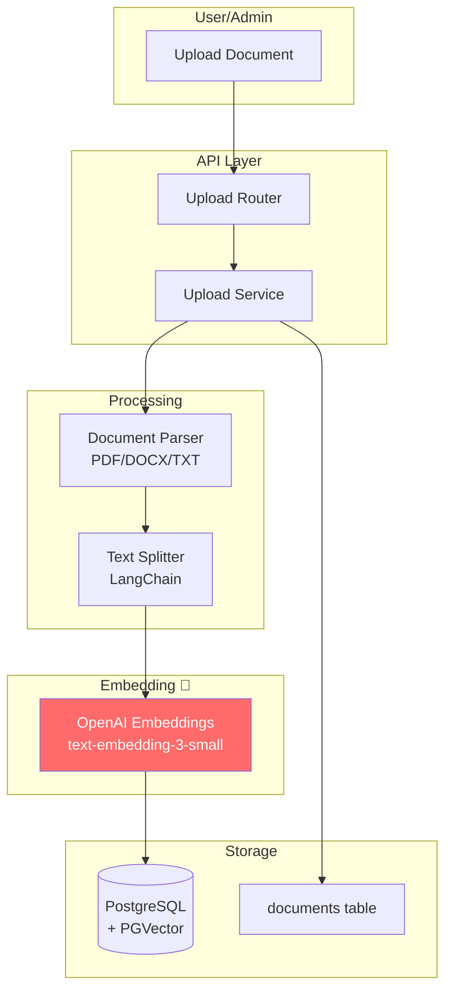
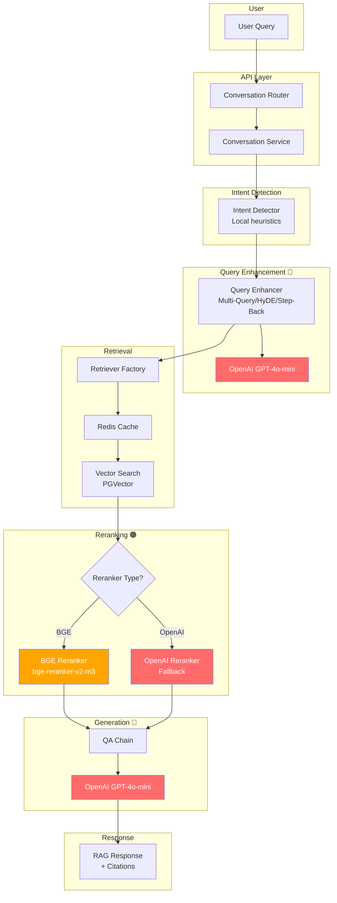
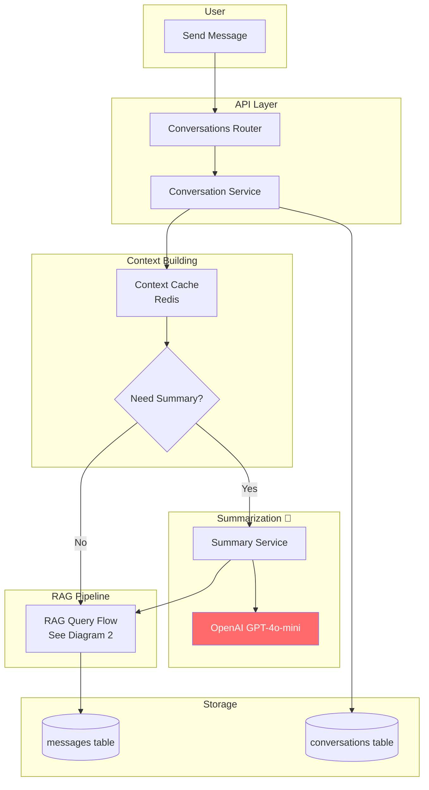
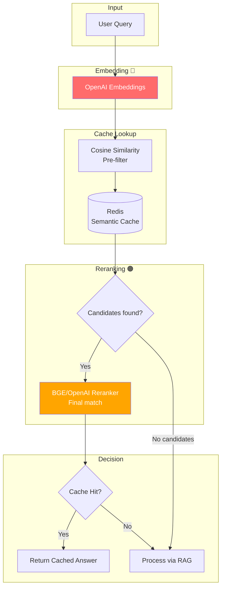

# RAG-Bidding Backend Workflow Diagrams

Tài liệu này mô tả các luồng hoạt động chính của hệ thống RAG-Bidding backend và đánh dấu các dịch vụ third-party đang được sử dụng.

---

## 1. Document Ingestion Flow

**Third-Party Services:**
| Service | Provider | Purpose |
|---------|----------|---------|
| 🔴 Embeddings | OpenAI | Text → Vector (1536 dims) |

**Files liên quan:**
- [`upload_service.py`](file:///home/sakana/Code/RAG-project/RAG-bidding/src/api/services/upload_service.py)
- [`openai_embedder.py`](file:///home/sakana/Code/RAG-project/RAG-bidding/src/embedding/embedders/openai_embedder.py)
- [`pgvector_store.py`](file:///home/sakana/Code/RAG-project/RAG-bidding/src/embedding/store/pgvector_store.py)

---

## 2. RAG Query Flow

**Third-Party Services:**
| Service | Provider | Purpose |
|---------|----------|---------|
| 🔴 Query Enhancement | OpenAI GPT-4o-mini | Generate query variations |
| 🟠 BGE Reranker | HuggingFace | Cross-encoder reranking |
| 🔴 OpenAI Reranker | OpenAI | Fallback reranking |
| 🔴 LLM Generation | OpenAI GPT-4o-mini | Answer generation |

**Files liên quan:**
- [`qa_chain.py`](file:///home/sakana/Code/RAG-project/RAG-bidding/src/generation/chains/qa_chain.py)
- [`base_strategy.py`](file:///home/sakana/Code/RAG-project/RAG-bidding/src/retrieval/query_processing/strategies/base_strategy.py)
- [`bge_reranker.py`](file:///home/sakana/Code/RAG-project/RAG-bidding/src/retrieval/ranking/bge_reranker.py)
- [`openai_reranker.py`](file:///home/sakana/Code/RAG-project/RAG-bidding/src/retrieval/ranking/openai_reranker.py)
- [`retrievers/__init__.py`](file:///home/sakana/Code/RAG-project/RAG-bidding/src/retrieval/retrievers/__init__.py)

---

## 3. Conversation Flow

**Third-Party Services:**
| Service | Provider | Purpose |
|---------|----------|---------|
| 🔴 Summarization | OpenAI GPT-4o-mini | Conversation summary |

**Files liên quan:**
- [`conversation_service.py`](file:///home/sakana/Code/RAG-project/RAG-bidding/src/api/services/conversation_service.py)
- [`summary_service.py`](file:///home/sakana/Code/RAG-project/RAG-bidding/src/api/services/summary_service.py)

---

## 4. Semantic Cache Flow

**Third-Party Services:**
| Service | Provider | Purpose |
|---------|----------|---------|
| 🔴 Embeddings | OpenAI | Query embedding for similarity |
| 🟠 Reranker | BGE/OpenAI | Accurate cache matching |

**Files liên quan:**
- [`semantic_cache_v2.py`](file:///home/sakana/Code/RAG-project/RAG-bidding/src/retrieval/semantic_cache_v2.py)
- [`cached_retrieval.py`](file:///home/sakana/Code/RAG-project/RAG-bidding/src/retrieval/cached_retrieval.py)

---

## Third-Party Services Summary

| Màu | Provider | Services | Files Count |
|-----|----------|----------|-------------|
| 🔴 Red | OpenAI | LLM, Embeddings, Reranker | 9 files |
| 🟠 Orange | HuggingFace | BGE Reranker | 1 file |

### Migration Priority
1. **High**: OpenAI LLM (5 files) - Core RAG functionality
2. **Medium**: OpenAI Embeddings (4 files) - ⚠️ Requires re-embedding
3. **Low**: Reranker (2 files) - BGE works well locally
