# RAG-Bidding Backend Workflow Diagrams

Tài liệu này mô tả các luồng hoạt động chính của hệ thống RAG-Bidding backend và đánh dấu các dịch vụ third-party đang được sử dụng.

---

## 1. Document Ingestion Flow

**Third-Party Services:**
| Service | Provider | Purpose |
|---------|----------|---------|
| 🔴 Embeddings | OpenAI | Text → Vector (1536 dims) |

**Files liên quan:**
- [`upload_service.py`](file:///home/sakana/Code/RAG-project/RAG-bidding/src/api/services/upload_service.py)
- [`openai_embedder.py`](file:///home/sakana/Code/RAG-project/RAG-bidding/src/embedding/embedders/openai_embedder.py)
- [`pgvector_store.py`](file:///home/sakana/Code/RAG-project/RAG-bidding/src/embedding/store/pgvector_store.py)

---

## 2. RAG Query Flow

```mermaid
flowchart TD
    subgraph "User"
        Q[User Query]
    end
    
    subgraph "API Layer"
        CONV[Conversation Router]
        CS[Conversation Service]
    end
    
    subgraph "Intent Detection"
        ID[Intent Detector<br/>Local heuristics]
    end
    
    subgraph "Query Enhancement 🔴"
        QE[Query Enhancer<br/>Multi-Query/HyDE/Step-Back]
        LLM_QE[OpenAI GPT-4o-mini]
    end
    
    subgraph "Retrieval"
        RET[Retriever Factory]
        VEC[Vector Search<br/>PGVector]
        CACHE[Redis Cache]
    end
    
    subgraph "Reranking 🟠"
        RERANK{Reranker Type?}
        BGE[BGE Reranker<br/>bge-reranker-v2-m3]
        OAI_RERANK[OpenAI Reranker<br/>Fallback]
    end
    
    subgraph "Generation 🔴"
        QA[QA Chain]
        LLM[OpenAI GPT-4o-mini]
    end
    
    subgraph "Response"
        RESP[RAG Response<br/>+ Citations]
    end
    
    Q --> CONV --> CS --> ID
    ID --> QE --> LLM_QE
    QE --> RET
    RET --> CACHE
    CACHE --> VEC
    VEC --> RERANK
    RERANK -->|BGE| BGE
    RERANK -->|OpenAI| OAI_RERANK
    BGE --> QA
    OAI_RERANK --> QA
    QA --> LLM --> RESP
    
    style LLM_QE fill:#ff6b6b,color:#fff
    style LLM fill:#ff6b6b,color:#fff
    style BGE fill:#ffa500,color:#fff
    style OAI_RERANK fill:#ff6b6b,color:#fff
```

**Third-Party Services:**
| Service | Provider | Purpose |
|---------|----------|---------|
| 🔴 Query Enhancement | OpenAI GPT-4o-mini | Generate query variations |
| 🟠 BGE Reranker | HuggingFace | Cross-encoder reranking |
| 🔴 OpenAI Reranker | OpenAI | Fallback reranking |
| 🔴 LLM Generation | OpenAI GPT-4o-mini | Answer generation |

**Files liên quan:**
- [`qa_chain.py`](file:///home/sakana/Code/RAG-project/RAG-bidding/src/generation/chains/qa_chain.py)
- [`base_strategy.py`](file:///home/sakana/Code/RAG-project/RAG-bidding/src/retrieval/query_processing/strategies/base_strategy.py)
- [`bge_reranker.py`](file:///home/sakana/Code/RAG-project/RAG-bidding/src/retrieval/ranking/bge_reranker.py)
- [`openai_reranker.py`](file:///home/sakana/Code/RAG-project/RAG-bidding/src/retrieval/ranking/openai_reranker.py)
- [`retrievers/__init__.py`](file:///home/sakana/Code/RAG-project/RAG-bidding/src/retrieval/retrievers/__init__.py)

---

## 3. Conversation Flow

```mermaid
flowchart TD
    subgraph "User"
        MSG[Send Message]
    end
    
    subgraph "API Layer"
        CR[Conversations Router]
        CS[Conversation Service]
    end
    
    subgraph "Context Building"
        CTX[Context Cache<br/>Redis]
        SUM_CHECK{Need Summary?}
    end
    
    subgraph "Summarization 🔴"
        SUM_SVC[Summary Service]
        SUM_LLM[OpenAI GPT-4o-mini]
    end
    
    subgraph "RAG Pipeline"
        RAG[RAG Query Flow<br/>See Diagram 2]
    end
    
    subgraph "Storage"
        MSG_DB[(messages table)]
        CONV_DB[(conversations table)]
    end
    
    MSG --> CR --> CS
    CS --> CTX
    CTX --> SUM_CHECK
    SUM_CHECK -->|Yes| SUM_SVC --> SUM_LLM
    SUM_CHECK -->|No| RAG
    SUM_SVC --> RAG
    RAG --> MSG_DB
    CS --> CONV_DB
    
    style SUM_LLM fill:#ff6b6b,color:#fff
```

**Third-Party Services:**
| Service | Provider | Purpose |
|---------|----------|---------|
| 🔴 Summarization | OpenAI GPT-4o-mini | Conversation summary |

**Files liên quan:**
- [`conversation_service.py`](file:///home/sakana/Code/RAG-project/RAG-bidding/src/api/services/conversation_service.py)
- [`summary_service.py`](file:///home/sakana/Code/RAG-project/RAG-bidding/src/api/services/summary_service.py)

---

## 4. Semantic Cache Flow

```mermaid
flowchart TD
    subgraph "Input"
        Q[User Query]
    end
    
    subgraph "Embedding 🔴"
        EMB[OpenAI Embeddings]
    end
    
    subgraph "Cache Lookup"
        COS[Cosine Similarity<br/>Pre-filter]
        REDIS[(Redis<br/>Semantic Cache)]
    end
    
    subgraph "Reranking 🟠"
        RERANK{Candidates found?}
        BGE[BGE/OpenAI Reranker<br/>Final match]
    end
    
    subgraph "Decision"
        HIT{Cache Hit?}
        CACHED[Return Cached Answer]
        PROCESS[Process via RAG]
    end
    
    Q --> EMB --> COS
    COS --> REDIS
    REDIS --> RERANK
    RERANK -->|Yes| BGE --> HIT
    RERANK -->|No candidates| PROCESS
    HIT -->|Yes| CACHED
    HIT -->|No| PROCESS
    
    style EMB fill:#ff6b6b,color:#fff
    style BGE fill:#ffa500,color:#fff
```

**Third-Party Services:**
| Service | Provider | Purpose |
|---------|----------|---------|
| 🔴 Embeddings | OpenAI | Query embedding for similarity |
| 🟠 Reranker | BGE/OpenAI | Accurate cache matching |

**Files liên quan:**
- [`semantic_cache_v2.py`](file:///home/sakana/Code/RAG-project/RAG-bidding/src/retrieval/semantic_cache_v2.py)
- [`cached_retrieval.py`](file:///home/sakana/Code/RAG-project/RAG-bidding/src/retrieval/cached_retrieval.py)

---

## Third-Party Services Summary

| Màu | Provider | Services | Files Count |
|-----|----------|----------|-------------|
| 🔴 Red | OpenAI | LLM, Embeddings, Reranker | 9 files |
| 🟠 Orange | HuggingFace | BGE Reranker | 1 file |

### Migration Priority
1. **High**: OpenAI LLM (5 files) - Core RAG functionality
2. **Medium**: OpenAI Embeddings (4 files) - ⚠️ Requires re-embedding
3. **Low**: Reranker (2 files) - BGE works well locally
